This is a repository for the source code of various 3D programlets.

### 36. [Wind waves [Three.js]](threejs/wind-waves.html)
<a href="threejs/wind-waves.html">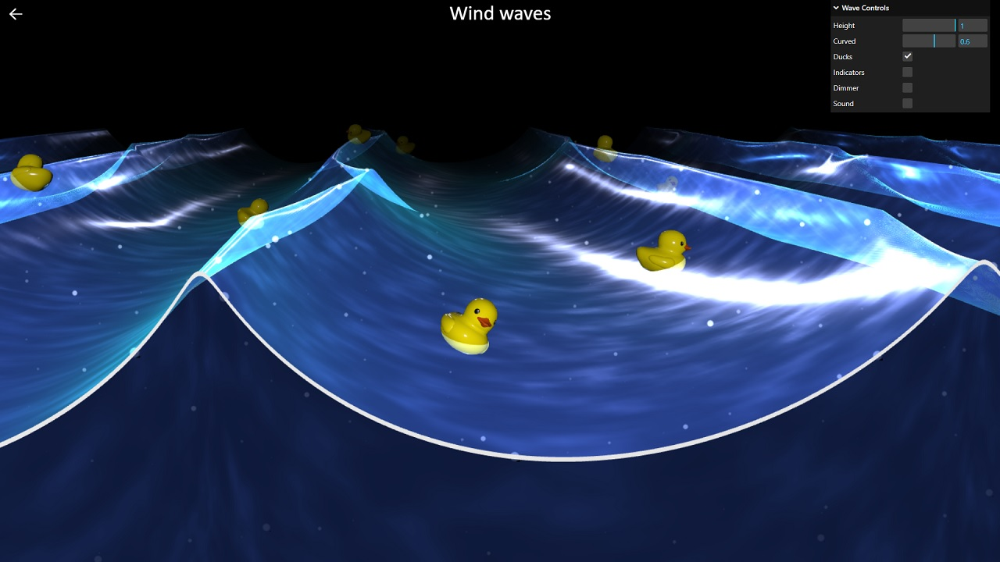</a> Water in wind generated waves exibits circular motion at or near the water surface. The water stays almost at the same place, but the peaks of its motion are relayed in the form of waves. This etude is a recreation of the Elica video "[Circular motion in wind generated waves](https://www.youtube.com/watch?v=NShUBfJQEHk)".

### 35. [Day and night [Suica]](suica/day-and-night.html)
<a href="suica/day-and-night.html">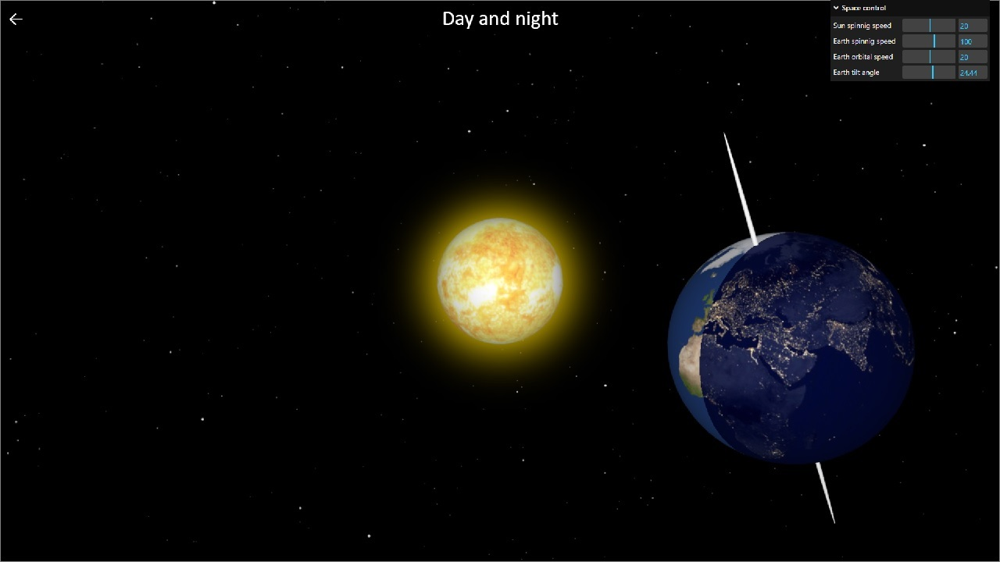</a> A recreation of an ancient Elica demo called " Day and night" (here is a [video](https://www.youtube.com/watch?v=LCLw1s5oD8w) published in 2010). This etude adds control for the speed of Sun's and Earth's rotations (including negative speeds), Earth's orbital speed and Earth's tilt angle.

### 34. [Twisted torus [Three.js + CodePen]](threejs/twisted-torus.html)
<a href="threejs/twisted-torus.html">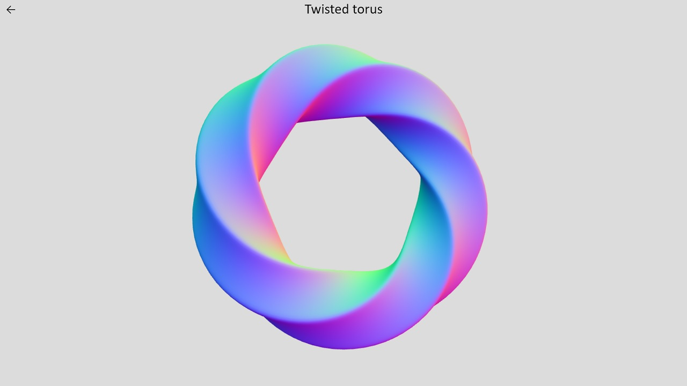</a> This etude demonstrates how a twisted torus can be generated as a parametric surface. The cross-section of the torus is a rounded square made of [superellipse](https://en.wikipedia.org/wiki/Superellipse), otherwise the twisting is hard to notice.

### 33. [Perspective projection [Suica.js + Three.js]](suica/perspective-projection.html)
<a href="suica/perspective-projection.html">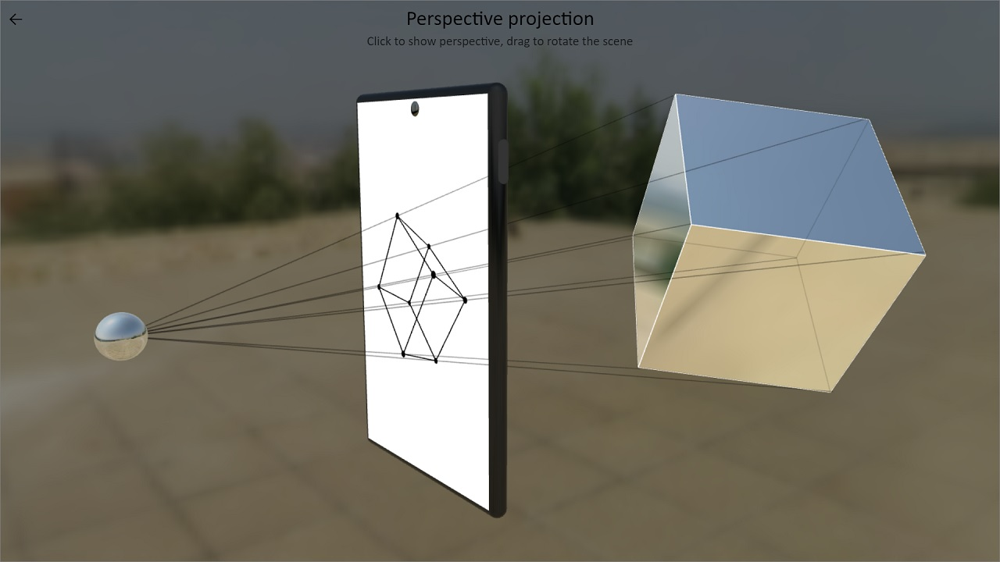</a> Imagine a cube animated on a smartphone screen. Although it is implemented by a matrix multiplication, it can be visualized as a set of rays between the viewer and a virtual cube rotating in the 3D space behind the screen.

### 32. [Hologram sticker [Threejs.js]](threejs/hologram-sticker.html)
<a href="threejs/hologram-sticker.html">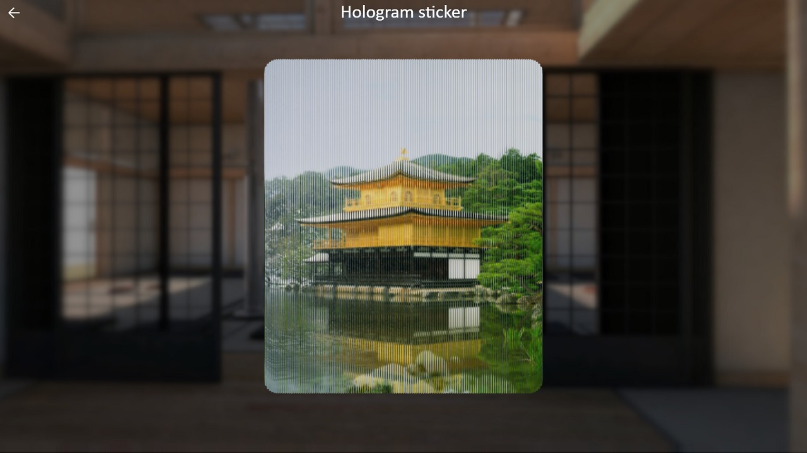</a> Hologram stickers combine two images into one. By changing the point of view the stickers reveal one of the images. This étude simulated such hologram sticker by creating a completely static object (both its geometry and  material are static).

### 31. [Bézier space [Threejs.js]](threejs/bezier-space.html)
<a href="threejs/bezier-space.html">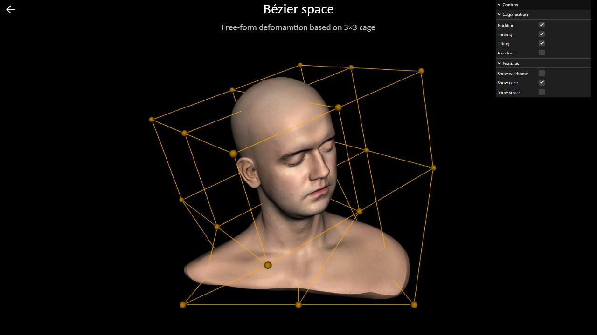</a> If it is needed to freely deform a 3D object, it can be placed in a Bézier space. Its control points form a cage which manipulation generates a deformation in intuitive and predictable way. Internally, Bézier space is just a 3D version of Bézier surfaces and Bézier curves. 

### 30. [Fluid effects [Threejs.js]](threejs/fluid-effects.html)
<a href="threejs/fluid-effects.html">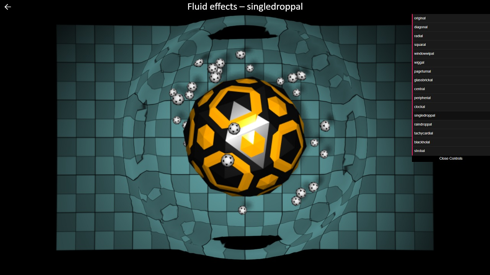</a> Shaders are the common way to add posteffects to 3D scenes. However, in Three.js a thin transmissive layer above the scene could  mimic some effects without custom shaders and without using EffectComposer. This etude shows 16 formula-driven fluid effects.

### 29. [XRay glass [Threejs.js]](threejs/xray-glass.html)
<a href="threejs/xray-glass.html">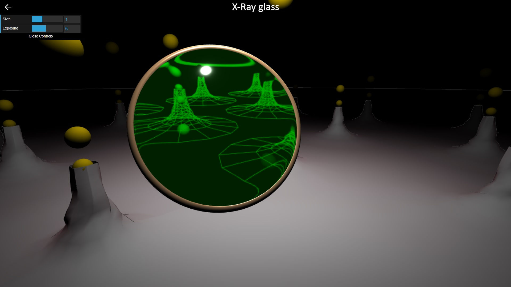</a> Achieving transparency with blending operations relies on render order and it might be a problem. However, transparency with finely tuned render order can be used to filter out objects without stencil buffers or multiple render passes.

### 28. [Maze generator [Suica.js]](suica/maze-generator.html?size=20x15)
 One of the simplest algorithms for maze generation is to split a room by a wall and add one door in this wall. This is repeated recursively with both halves. The algorithm guarantees a single path between any two points. Try: [micro](suica/maze-generator.html?size=2x2), [small](suica/maze-generator.html?size=4x4), [normal](suica/maze-generator.html?size=12x8), [big](suica/maze-generator.html?size=24x12), [big+rooms](suica/maze-generator.html?size=30x20x3)

### 27. [Voronoiless [Three.js]](threejs/voronoiless.html)
<a href="threejs/voronoiless.html">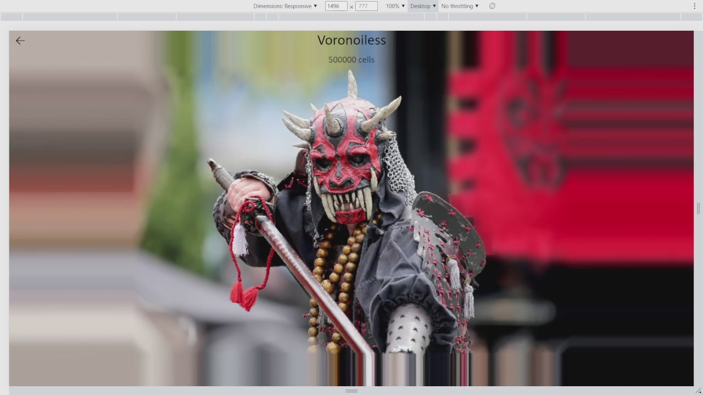</a> Voronoi diagrams [[more info](https://en.wikipedia.org/wiki/Voronoi_diagram)] partitions the plane into regions based on a set of points. This etude demonstrates how to construct a Voronoi diagram based on an image without any special algorithm.

### 26. [Hollow-face illusion [Three.js]](threejs/hollow-face-illusion.html)
<a href="threejs/hollow-face-illusion.html">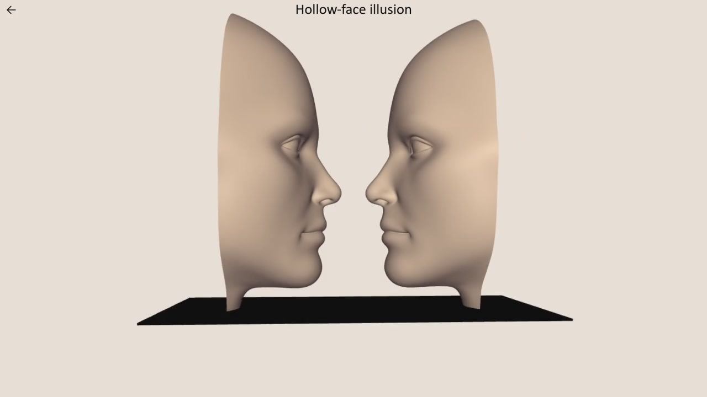</a> The hollow-face illusion [[more info](https://en.wikipedia.org/wiki/Hollow-Face_illusion)], tricks our brains to think that a concave shape is convex. The illusion works not only horizontally, but also &ndash; vertically.

### 25. [Ghosts in the rain [Three.js]](threejs/ghosts-in-the-rain.html)
<a href="threejs/ghosts-in-the-rain.html">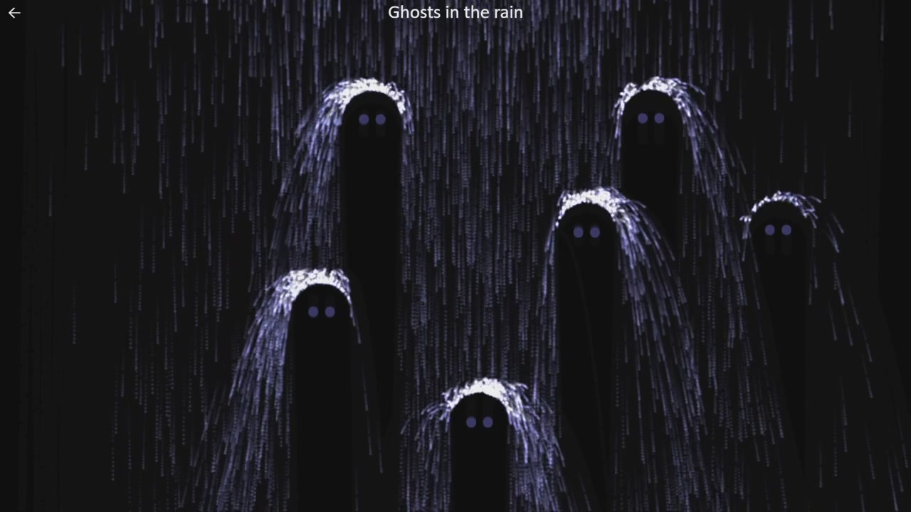</a> Insired by the generative art and creative coding by Senbaku [posted here](https://twitter.com/senbaku/status/1473548401019355140), let's try to model and animate it in Three.js. Rain is modelled by particle system with trails.

### 24. [Capping clipping [Three.js]](threejs/capping-clipping.html)
<a href="threejs/capping-clipping.html">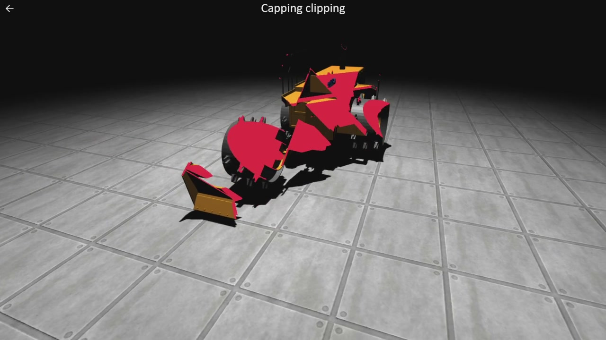</a> Once a student asked me how to cap clipped object without stencil buffers and without CSG. It appears it is possible to make fake capping by drawing the back faces of the models (they are seen through the clipped areas) in flat colour.

### 23. [Brain and motion [Three.js]](threejs/brain-and-motion.html)
<a href="threejs/brain-and-motion.html">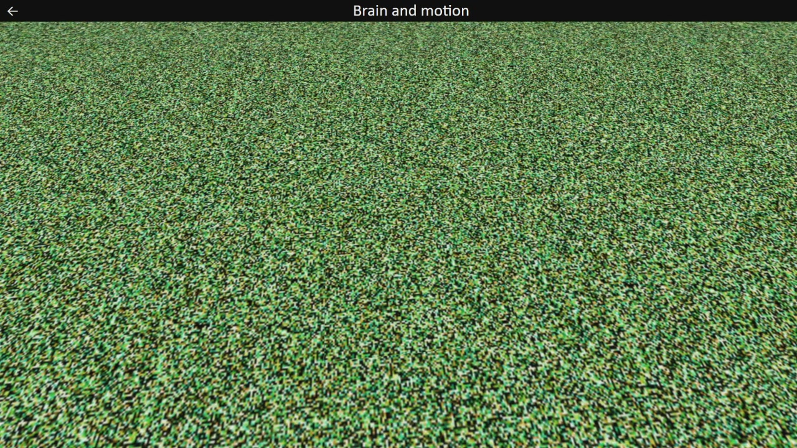</a> You know that animals' brains are wired in a way to detect motion. The human brain is no exception. We use motion to detect shape, position and orientation ot objects. Do not believe me? Try it for yourself.

### 22. [Negative morphs [Three.js]](threejs/negative-morphs.html)
<a href="threejs/negative-morphs.html">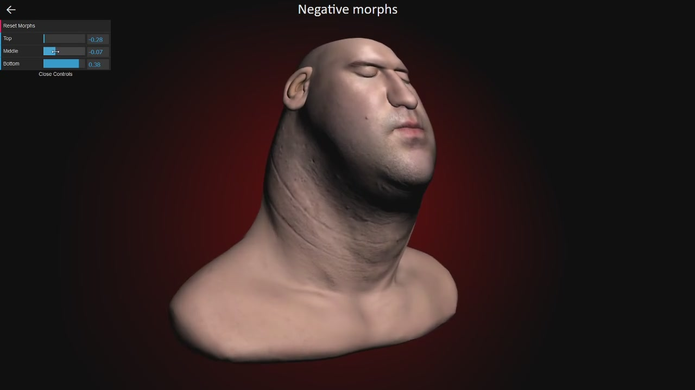</a> Do you know that morph target influence could be negative? Thus the morth target will not attract, but repel the shape. This étude use three spheres as morth targets with user-defined interactive influence.

### 21. [Psychedelic tapeworm [Three.js]](threejs/psychedelic-tapeworm.html)
<a href="threejs/psychedelic-tapeworm.html">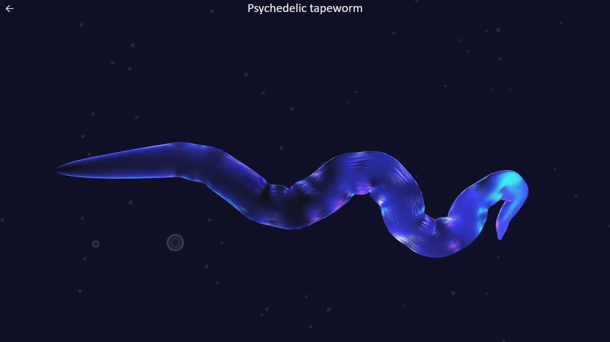</a> A deformed sphere with 21 bones and fast lights are enough to create a psychedelic tapeworm.

### 20. [Tentacle with suckers [Three.js]](threejs/tentacle-with-suckers.html)
<a href="threejs/tentacle-with-suckers.html">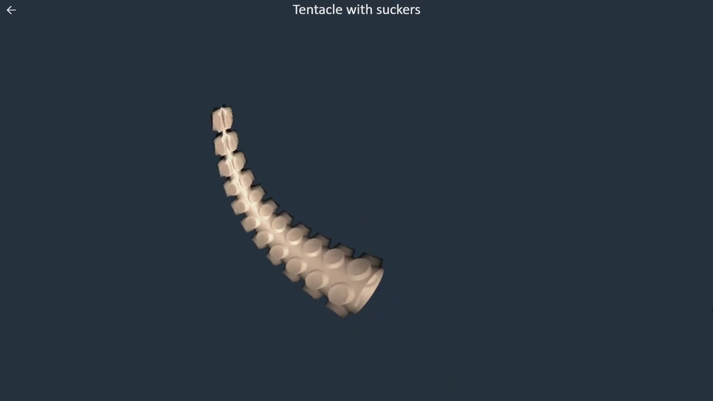</a> Skinned mesh works fine with displacement and bump maps. The skeleton is responsible for the tentacle motion. The displacement map extrudes the suckers as 3D shapes. The bump map fixes the lighting. The trick is that the texture for the displacement and the bump is the same.

### 19. [Freezing cube [WebGL]](webgl/freezing-cube.html)
<a href="webgl/freezing-cube.html">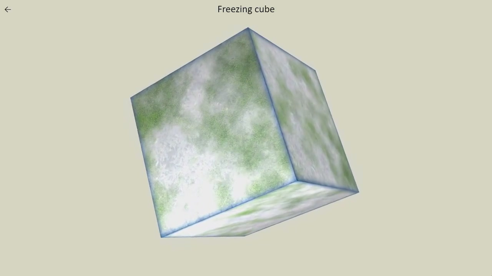</a> Textured can be used to represent time offsets. The cube in this étude changes its texture from [moss](webgl/freezing-cube/moss.jpg) to [ice](webgl/freezing-cube/frost.jpg) based on a [temporal texture](webgl/freezing-cube/time.jpg). Thus time factor of each texel is modified by the corresponding texel from the temporal texture.

### 18. [Rolling ball [Three.js]](threejs/rolling-ball.html)
<a href="threejs/rolling-ball.html">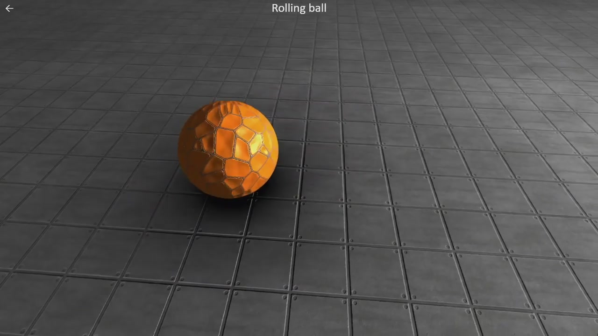</a> Rolling a ball along a curved path requires rotation around a moving axis. This is achieved by using `rotateOnWorldAxis` on an axis perpendicular to the direction of rolling. The angle of rotation is the travelled distance devided by the ball's radius.

### 17. [Happy New Year [Three.js]](threejs/happy-new-year.html)
<a href="threejs/happy-new-year.html">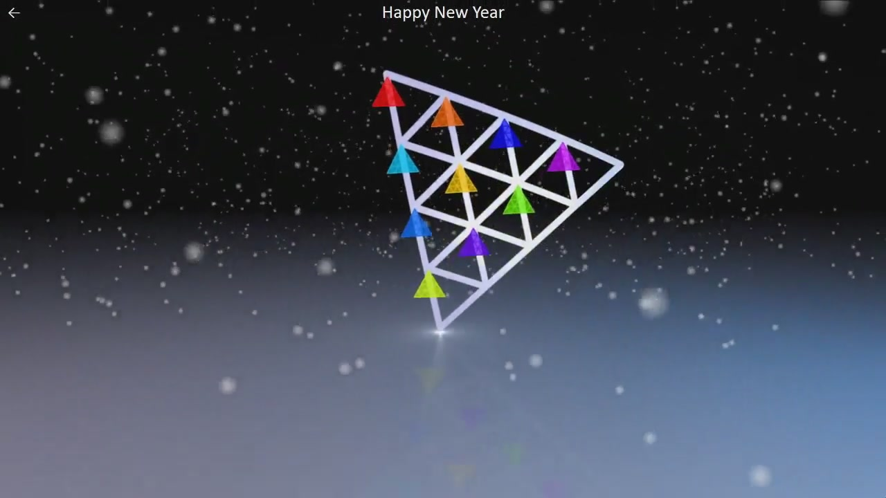</a> A small animated New Year greeting card for all Three.js-ers.

### 16. [Interference [WebGL]](webgl/interference.html)
<a href="webgl/interference.html">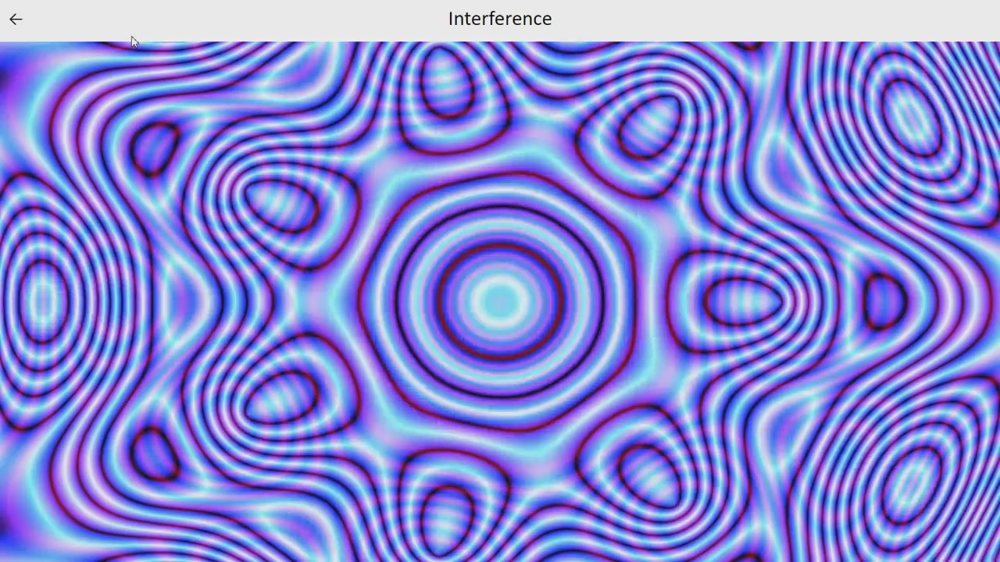</a> Interference is the phenomenon when two or more waves interfere and create patterns of reinforced or cancelled displacements. This model overlaps bluish sine waves and reddish cosine waves.

### 15. [Negative spave [Three.js]](threejs/negative-space.html)
<a href="threejs/negative-space.html">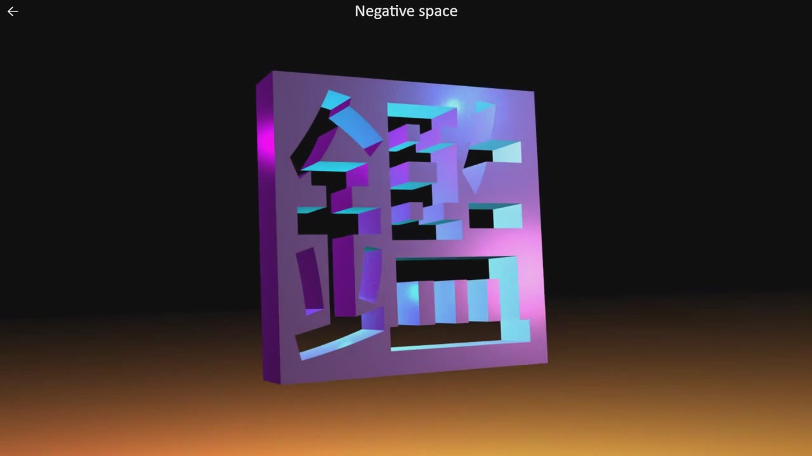</a> Negative space is when the shape of an object is defined by the solid space around it. The object per se does not exist. This model of a negative space kanji is actually a homework assignment for my students. It is given 9 hours after they met Three.js and JavaScript for the first time.

### 14. [Matrix chaplet [WebGL]](webgl/matrix-chaplet.html)
<a href="webgl/matrix-chaplet.html">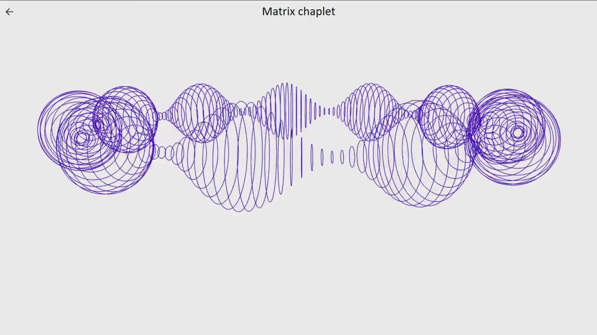</a> Object data may not contain vertex coordinates at all. The data buffer of this étude contains the numbers 0 to 59 that define a circle, which is transformed by matrices into a chaplet.

### 13. [Jelly balls [Three.js]](threejs/jelly-balls.html)
<a href="threejs/jelly-balls.html">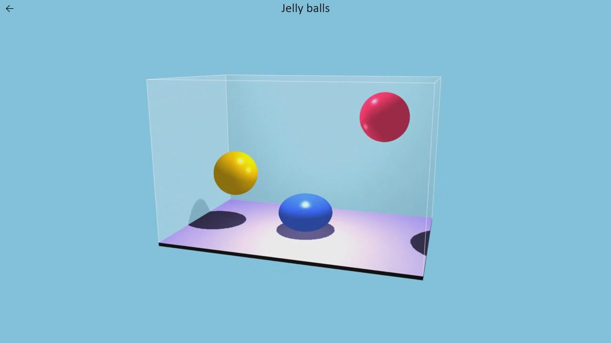</a> A low-cost approximation of bouncing jelly balls uses the observation that a vertically compressed ball should expand horizontally.

### 12. [Look Ma, no quaternions [Three.js]](threejs/look-ma-no-quaternions.html)
<a href="threejs/look-ma-no-quaternions.html">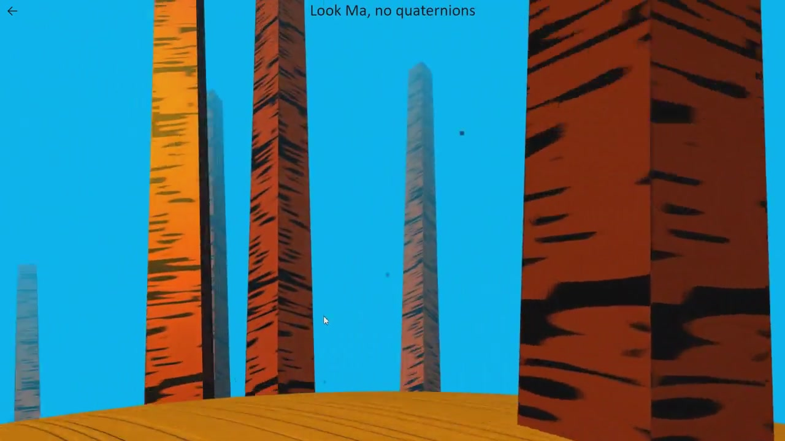</a> For free-walking on a sphere you can use pure Three.js vector arithmetic. No need to fight with quaternions, matrices, Euler angles and gimbal locks. Slide the mouse or your finger to see it in this. 

### 11. [Minimalistic village [Three.js]](threejs/minimalistic-village.html)
<a href="threejs/minimalistic-village.html">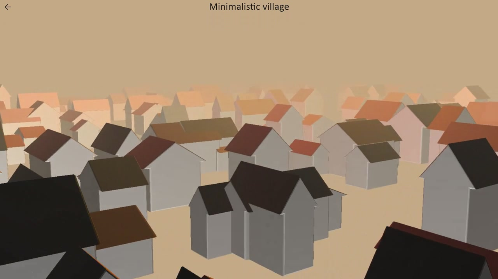</a> Sometimes simple minimalistic solutions provide enough complexity. A 2D upvote arrow shape could be extruded into a house. And then, multiple houses could be arranged in a small village.

### 10. [Sine cheers [WebGL]](webgl/sine-cheers.html)
<a href="webgl/sine-cheers.html">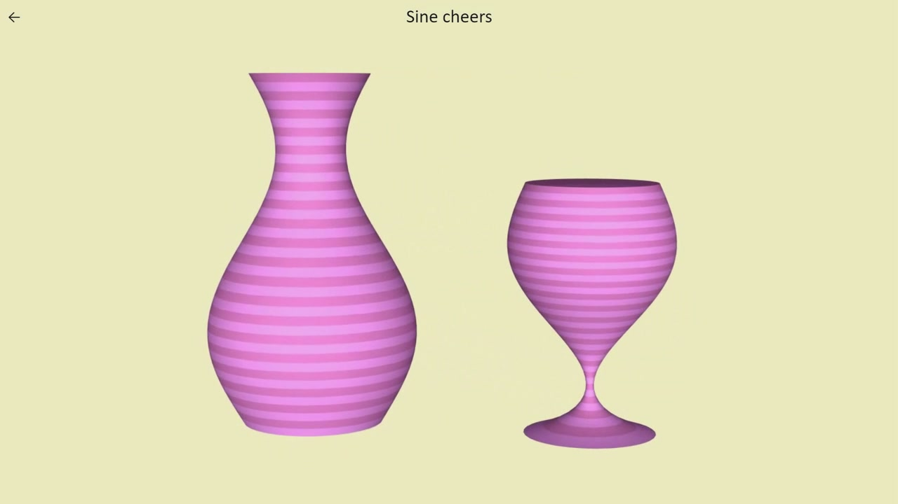</a> The sine curve can be used to define hundreds of rotational shapes. Do you know that the wine jug and the wine glass are among those shapes? See [here](webgl/sine-cheers-graph.jpg). Cheers!

### 9. [Lantern [Three.js]](threejs/lantern.html)
<a href="threejs/lantern.html">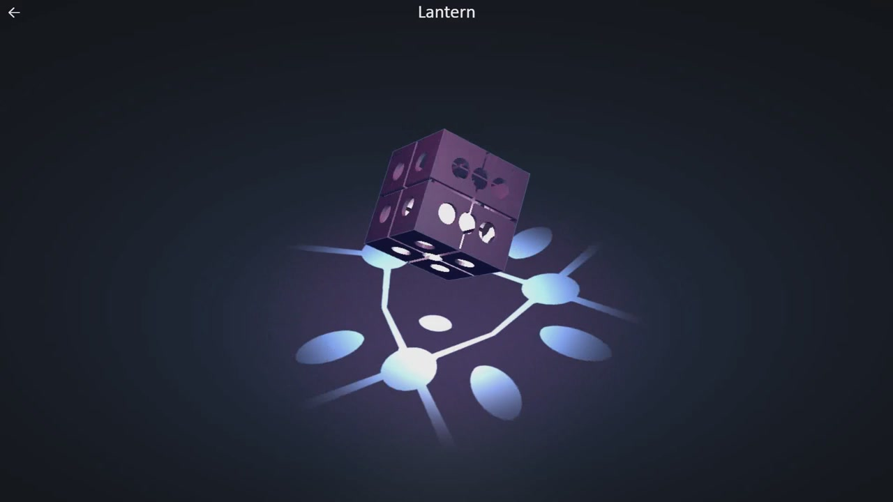</a> Constructive Solid Geometry ([CSG](https://en.wikipedia.org/wiki/Constructive_solid_geometry)) is a technique to build models by combining, subtracting or intersecting shapes. CSG also provides algebraic notation of models' construction.

### 8. [Graphical integration [WebGL]](webgl/graphical-integration.html)
<a href="webgl/graphical-integration.html">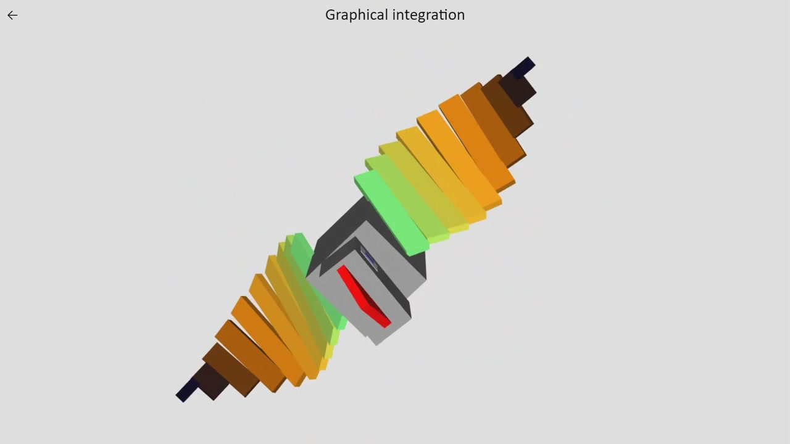</a> Every curved or bending surface could be represented by a set of small flat plates. This is the computer graphics analog to mathematical integration.

### 7. [Bingo balls [Three.js]](threejs/bingo-balls.html)
<a href="threejs/bingo-balls.html">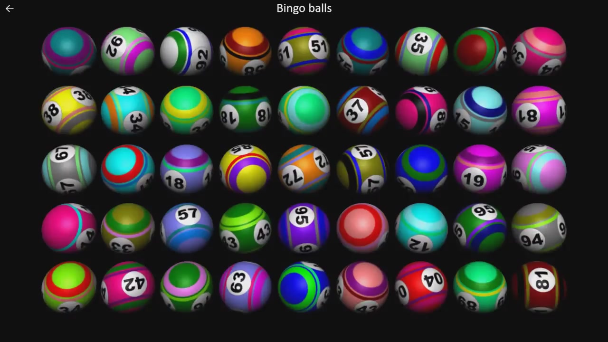</a> Not all textures need to be loaded from files. These bingo balls get their textures drawn at startup via [Canvas API](https://developer.mozilla.org/en-US/docs/Web/API/Canvas_API).

### 6. [Supersphere [WebGL]](webgl/supersphere.html)
<a href="webgl/supersphere.html">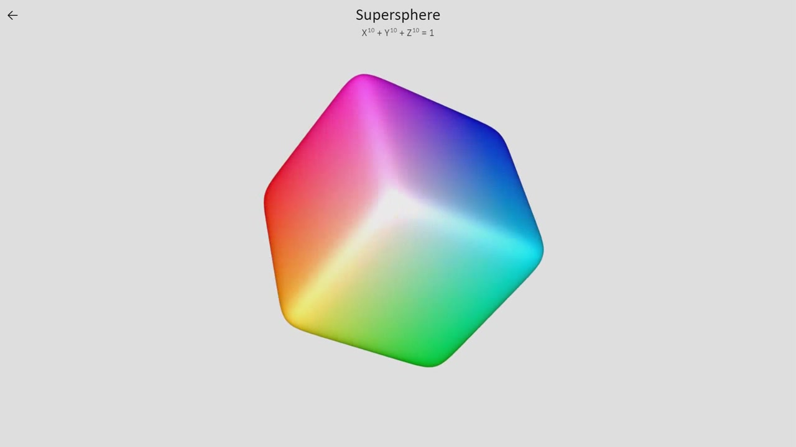</a> Spheres, cubes, octahedrons ... are all instances of the supesphere X<small>n</small> + Y<small>n</small> + Z<small>n</small> = 1.

### 5. [Crystal planet [Three.js]](threejs/crystal-planet.html)
<a href="threejs/crystal-planet.html">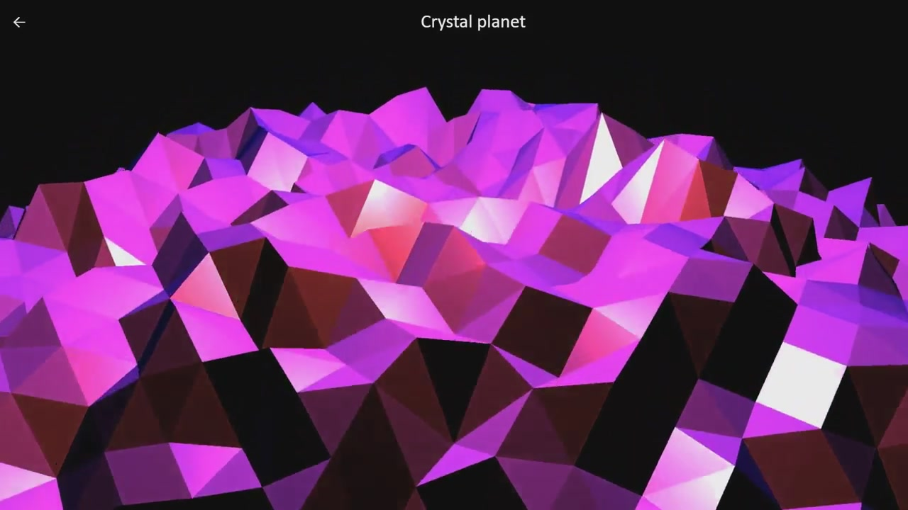</a> A planet is created as a level-5 icosahedron with a randomized geometry &ndash; actually, only the distance to the center is randomized.

### 4. [Neon tori [WebGL]](webgl/neon-tori.html)
<a href="webgl/neon-tori.html">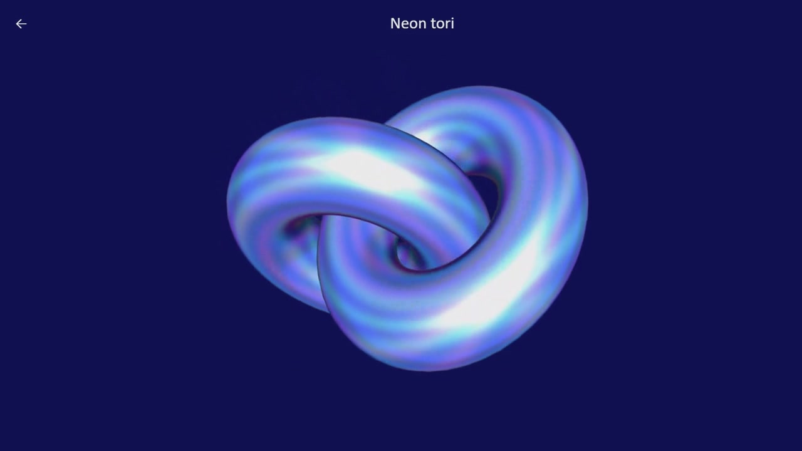</a> Using shader to generate neonish shiny surface of a torus. Colour stripes are defined by the direction of the reflection rays.

### 3. [Snowing [Three.js]](threejs/snowing.html)
<a href="threejs/snowing.html">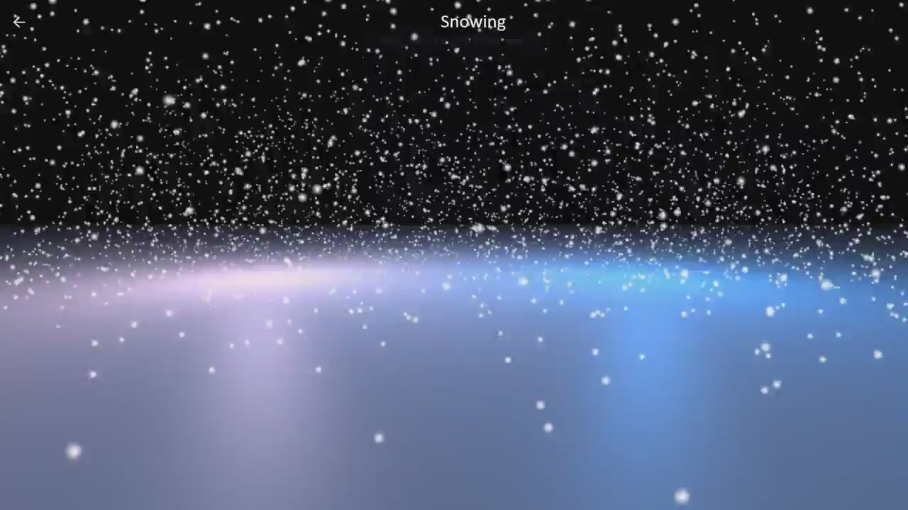</a> A simple model of snowing scene. The snowflake's texture is generated programmatically.

### 2. [Hearts [WebGL]](webgl/hearts.html)
<a href="webgl/hearts.html">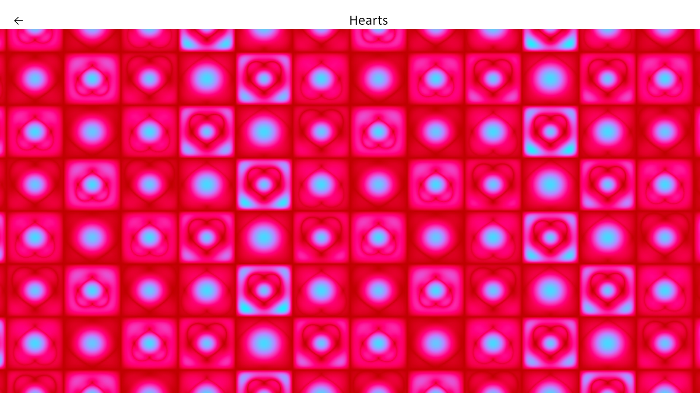</a> One of the most aesthetically pleasing heart curve is defined by (x2+y2-1)3-x2y3=0. Let's improvise on it.

### 1. [Negative Light [Three.js]](threejs/negative-light.html)
<a href="threejs/negative-light.html">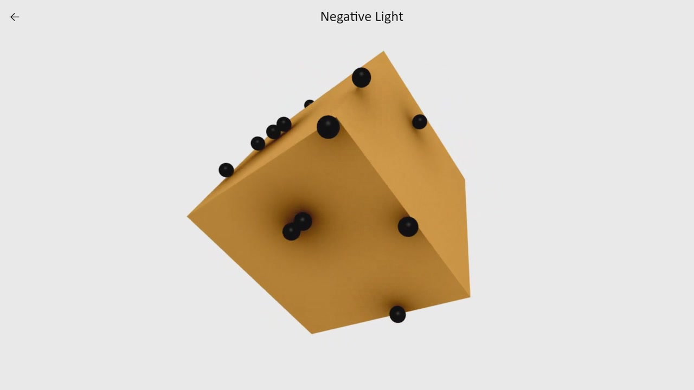</a> Three.js allows negative intensities of lights. This might be used to simulate circular soft shadows.

